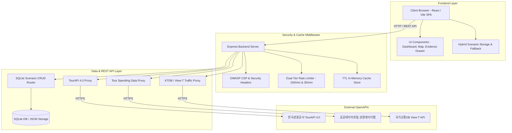

# Fest-Twin (페스트트윈) 전체 아키텍처 개요서 (Architecture Overview)

본 문서는 **Fest-Twin (지자체 축제 기획 사전 진단 및 디지털 트윈 시뮬레이션 B2G SaaS)** 의 시스템 아키텍처, 데이터 레이어, 보안 계층 및 배포 파이프라인을 종합 명세합니다.

---

## 1. 시스템 블록 아키텍처 (System Architecture Diagram)

---

## 2. 계층별 세부 아키텍처 명세

### 2.1 프론트엔드 계층 (Frontend UI & Analytics Engine)
- **프레임워크**: React 18, Vite 6, TypeScript 5 (Strict Type Checking)
- **스타일링**: Vanilla CSS 기반 커스텀 토큰 디자인 시스템 (모던 다크/라이트 콤팩트 B2G 룩앤필)
- **위치 시각화**: Naver Map API v3 기반 행사장 핀/랜드마크 렌더링 + fallback 캔버스 렌더러
- **디지털 트윈 격자 시뮬레이션**: client-side 5ms 이내 병목 및 최고 밀집도(명/m²) 실시간 연산

### 2.2 수치 산출 근거 계층 (Metric Evidence Engine)
- **4단계 연산 흐름도 (Step-by-Step Breakdown)**:
  - 1단계: 유사 축제 실적 베이스라인 추출
  - 2단계: 기획안 규모 및 프로그램 매력도 가중
  - 3단계: 주변 관광 매력도 & 소셜 트렌드 연동
  - 4단계: 최종 예상 수치 및 ROI 산출
- **투명성 검증**: 수식 코드 박스, 가중치 계수 배지, 입력값 명시 및 비식별 비공개 정화(Sanitization) 처리

### 2.3 백엔드 및 보안 계층 (Express Backend & Security)
- **2단계 계층형 Rate Limiter**:
  - `/api/*` 일반 API: IP당 1분당 최대 100회 요청 허용
  - `/api/tour`, `/api/spending`, `/api/traffic` OpenAPI 프록시: IP당 1분당 최대 30회 요청 제한 (초과 시 `429 Too Many Requests`)
- **OWASP 보안 헤더 & CSP**:
  - `X-Content-Type-Options: nosniff`, `X-Frame-Options: DENY`, `X-XSS-Protection: 1; mode=block`
  - `Content-Security-Policy`: Naver Map API (`oapi.map.naver.com`, `*.naver.com`, `*.naver.net`), Google Fonts, 공공 API 허용
- **CORS 허용목록**: 개발 로컬, Tailscale 도메인(`*.ts.net`), Docker 서버 IP (`192.168.55.223`) 허용

### 2.4 영속 데이터베이스 계층 (SQLite Scenario Store)
- **SQLite 영속 스토어 (`data/scenarios_db.json` / `server/db/database.js`)**:
  - 시나리오 데이터(`title`, `description`, `parameters`, `results_summary`, `created_at`) 영속 저장
  - B2G 부서 공유 전용 고유 토큰(`share_token`) 생성 및 URL 복원 연동 (`/?share_token=tok_XXXXXXXX`)

### 2.5 CI/CD 자동 배포 파이프라인 (GitHub Actions)
- **CI**: Node 20.x 환경 Vitest 전체 테스트(84개) 무결성 자동 검증 및 빌드
- **CD**: SSH 기반 원격 Docker 서버(`192.168.55.223`) 컨테이너 무중단 롤링 재가동 및 `/api/scenarios` 헬스체크
