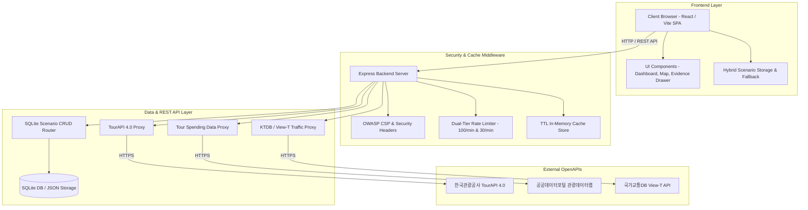

# Fest-Twin 전체 아키텍처 개요서

Fest-Twin (지자체 축제 기획 사전 진단 및 디지털 트윈 시뮬레이션 B2G SaaS)의 시스템 아키텍처, 데이터 레이어, 보안 계층 및 배포 파이프라인을 종합 기술합니다.

---

## 1. 시스템 블록 아키텍처

---

## 2. 계층별 세부 아키텍처 명세

### 2.1 프론트엔드 계층

React 18과 Vite 6 환경에서 TypeScript Strict 옵션을 적용하여 작성되었으며, 바닐라 CSS 기반 토큰 디자인 시스템으로 구현되었습니다.
행사장 지도 시각화는 Naver Map API v3를 활용하며, 지도가 로드되지 않는 환경에서는 캔버스 렌더러로 위치를 표시합니다.
디지털 트윈 격자 시뮬레이션은 클라이언트 사이드에서 5ms 이내로 병목 지점 및 최고 밀집도(명/m²)를 계산합니다.

### 2.2 수치 산출 근거 계층 (Metric Evidence Engine)

수치 추정 결과의 투명성을 위해 4단계 연산 흐름을 시각화합니다.

1. 유사 축제 실적 베이스라인 추출
2. 기획안 규모 및 프로그램 매력도 가중
3. 주변 관광 매력도 및 소셜 트렌드 연동
4. 최종 예상 수치 및 ROI 산출

수식 코드 박스, 가중치 계수 배지, 입력값을 명시하며 비식별 정화 처리를 적용합니다.

### 2.3 백엔드 및 보안 계층 (Express Backend & Security)

요청 목적에 맞춘 2단계 계층형 Rate Limiter를 적용합니다.

- 일반 API (`/api/*`): IP당 1분당 최대 100회 요청 허용
- 공공데이터 프록시 (`/api/tour`, `/api/spending`, `/api/traffic`): IP당 1분당 최대 30회 요청 제한

보안 강화를 위해 X-Content-Type-Options(nosniff), X-Frame-Options(DENY), X-XSS-Protection, Referrer-Policy 및 Naver Map API(`oapi.map.naver.com`)와 공공 API를 인가하는 Content-Security-Policy 헤더를 설정했습니다.
CORS는 개발 로컬 환경, Tailscale 도메인(`*.ts.net`), 원격 Docker 서버 IP (`192.168.55.223`) 출처만 허용합니다.

### 2.4 영속 데이터베이스 계층 (SQLite Scenario Store)

`server/db/database.js` 스토어를 통해 시나리오 항목(제목, 주소, 파라미터, 결과 요약)을 영속 저장합니다.
부서 간 공유를 위하여 8자리 난수 토큰(`share_token`)을 발급하며, URL 접속 시 해당 시나리오 조건을 자동으로 복원합니다.

### 2.5 CI/CD 자동 배포 파이프라인 (GitHub Actions)

`main` 브랜치 변경 시 GitHub Actions 파이프라인이 자동 구동됩니다.
CI 단계에서 Vitest 전체 84개 테스트 통과 및 프로덕션 빌드를 수행한 뒤, CD 단계에서 SSH 접속으로 원격 Docker 서버(`192.168.55.223`) 컨테이너를 무중단 재가동하고 `/api/scenarios` 헬스체크를 진행합니다.
