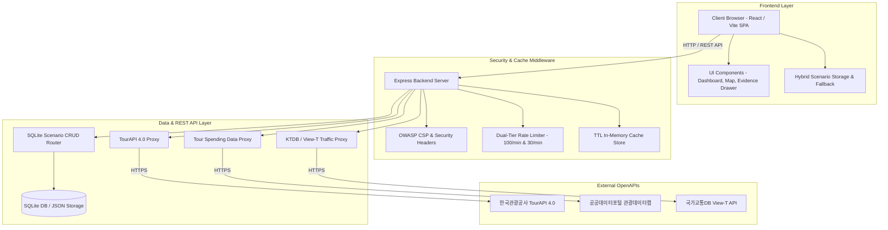

# Fest-Twin 시스템 아키텍처 및 REST API 명세서

Fest-Twin (지자체 축제 기획 사전 진단 및 디지털 트윈 시뮬레이션 B2G SaaS)의 시스템 구성, 아키텍처 계층, 보안 설계 및 RESTful API 규격을 통합 기술합니다.

---

## 1. 시스템 블록 아키텍처



---

## 2. 계층별 세부 아키텍처 설계

### 2.1 프론트엔드 계층 (React 18 & Vite 6 SPA)
- TypeScript Strict 모드가 적용된 SPA 아키텍처로 구현되었습니다.
- Vanilla CSS 기반의 디자인 시스템을 채택하여 모바일 및 와이드 스크린 반응형 레이아웃을 지원합니다.
- 행사장 지도는 Naver Map API v3를 활용하며, 지도가 로드되지 않는 환경에서는 HTML Canvas 기반 렌더러로 자치단체 위치 및 시설 격자를 안전하게 오버레이합니다.
- digital twin 격자 시뮬레이션 엔진은 클라이언트 측 연산으로 작동하여 5ms 이내로 병목 영역 및 최고 혼잡 밀도(명/m²)를 실시간 재계산합니다.

### 2.2 수치 산출 근거 엔진 (Metric Evidence Engine)
- 산출된 지표(방문객 수, 경제 효과, 혼잡 위험 등)의 신뢰성을 위해 4단계 연산 과정을 투명하게 시각화합니다:
  1. 유사 축제 실적 베이스라인 추출
  2. 기획안 규모 및 프로그램 매력도 가중치 부여
  3. 주변 관광 매력도 및 소셜 트렌드 연동
  4. 최종 예상 수치 및 ROI 산출
- 계산식, 계수 배지 및 데이터 원천(TourAPI, 관광데이터랩, KTDB)을 명시하며 비식별 정화 처리를 적용합니다.

### 2.3 백엔드 및 보안 계층 (Express Backend & OWASP Security)
- 2단계 계층형 Rate Limiter가 적용되어 시스템 및 공공데이터 쿼터를 보호합니다:
  - 일반 API (`/api/*`): IP당 1분당 최대 100회 요청 허용
  - 공공데이터 프록시 (`/api/tour`, `/api/spending`, `/api/traffic`): IP당 1분당 최대 30회 요청 제한
- 보안 강화를 위해 X-Content-Type-Options(nosniff), X-Frame-Options(DENY), X-XSS-Protection, Referrer-Policy 및 인가된 도메인만 통과시키는 Content-Security-Policy(CSP) 헤더를 설정했습니다.
- CORS 허용 출처: 개발 로컬 환경, Tailscale 도메인(`*.ts.net`), 원격 Docker 서버 IP (`192.168.55.223`).

### 2.4 영속 데이터베이스 계층 (SQLite Scenario Database)
- `server/db/database.js` 및 SQLite 영속 저장소를 통해 축제 기획안 파라미터와 결과 요약을 영속 저장합니다.
- 부서 간 편리한 공유를 위하여 8자리 난수 토큰(`share_token`)을 생성하며, 해당 URL 접속 시 기획 조건이 자동 복원됩니다.

---

## 3. RESTful API 명세서

### 3.1 공통 응답 및 에러 처리

#### 에러 응답 형식
```json
{
  "error": {
    "code": "ERROR_CODE",
    "message": "상세 에러 내용"
  }
}
```

### 3.2 시나리오 영속 보관 API (`/api/scenarios`)

| 메소드 | 엔드포인트 | 역할 | 비고 |
| :--- | :--- | :--- | :--- |
| GET | `/api/scenarios` | 저장된 시나리오 목록 조회 | 최신순 정렬 (분당 100회 제한) |
| GET | `/api/scenarios/:id` | 특정 시나리오 상세 조회 | ID 기반 조회 |
| GET | `/api/scenarios/share/:token` | 부서 공유 토큰 기반 시나리오 조회 | 공유 링크 복원용 |
| POST | `/api/scenarios` | 신규 시나리오 저장 | share_token 자동 발급 |
| PUT | `/api/scenarios/:id` | 기존 시나리오 정보 수정 | |
| DELETE | `/api/scenarios/:id` | 시나리오 삭제 | |

#### 시나리오 저장 요청 예시 (POST `/api/scenarios`)
```json
{
  "title": "2026 강남 미디어 윈터페스타",
  "description": "서울특별시 강남구 영동대로 511 (삼성동)",
  "parameters": {
    "selectedHour": 20,
    "plan": {
      "name": "2026 강남 미디어 윈터페스타",
      "region": "서울",
      "totalBudgetMillionKrw": 920,
      "expectedCapacity": 36000
    }
  },
  "results_summary": {
    "targetVisitors": 36000,
    "budgetKrw": 920000000
  }
}
```

### 3.3 공공데이터 프록시 API

외부 OpenAPI 쿼터 보호 및 빠른 응답을 위하여 10분 LRU 인메모리 캐시 및 분당 30회 제한 프록시를 구동합니다.

| 메소드 | 엔드포인트 | 데이터 연동 출처 | 설명 |
| :--- | :--- | :--- | :--- |
| GET | `/api/tour/area-code` | 한국관광공사 TourAPI 4.0 | 전국 광역시도 및 시군구 코드 조회 |
| GET | `/api/tour/search-festival` | 한국관광공사 TourAPI 4.0 | 지역별 유사 축제 행사 정보 조회 |
| GET | `/api/spending/consumer-strength` | 관광데이터랩 지출 데이터 | 지역별/업종별 방문객 객단가 및 소비지출 데이터 |
| GET | `/api/traffic/selected-link` | 국가교통DB (View-T) | 주요 혼잡 도로 구간 통행량 및 소요시간 데이터 |
