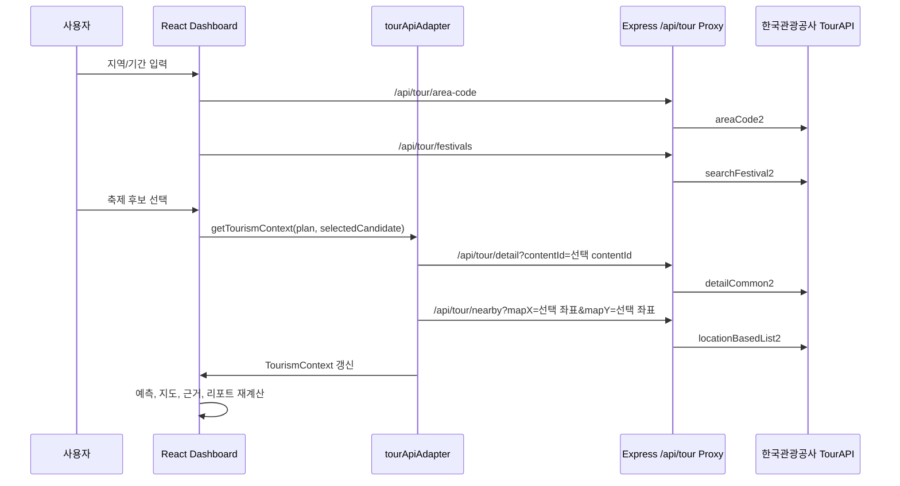

# 선택 축제 기준 데이터 갱신 흐름

## 목적

Fest-Twin은 TourAPI 후보 축제를 선택했을 때 단순히 입력 폼의 축제명만 바꾸지 않고, 선택한 실제 축제 후보를 대시보드 전체의 공공데이터 기준으로 사용한다. 이 문서는 2026-07-28 반영된 “축제 변경 시 실데이터 기준 갱신” 흐름을 설명한다.

## 사용자 흐름

1. 사용자가 지역과 기간을 입력한다.
2. `TourAPI 축제 후보 보기` 버튼으로 후보 패널을 연다.
3. 후보 목록에서 축제를 선택한다.
4. 선택 후보의 축제명, 주소, 기간, 좌표, `contentId`가 현재 기획안과 분석 기준으로 반영된다.
5. TourAPI 관광 컨텍스트, 지도, KPI 근거, 리포트가 선택 후보 기준으로 갱신된다.

## 데이터 흐름

## 선택 후보 기준값

| 값 | 용도 |
| :--- | :--- |
| `contentId` | TourAPI 상세 조회와 근거 추적의 기본 키 |
| `title` | 기획안 축제명, 검색 관심도 키워드, 리포트 제목 기준 |
| `address` | 행사장 주소와 지도 보조 정보 기준 |
| `startDate`, `endDate` | 분석 기간과 후보 기준 표시 |
| `mapX`, `mapY` | Naver 지도 위치와 TourAPI 주변 관광지 조회 기준 좌표 |

## 실제 조회 우선순위

선택 후보가 없는 경우에는 기존처럼 지역/기간 기반으로 `searchFestival2`를 조회한다.

선택 후보가 있는 경우에는 다음 순서로 우선 처리한다.

1. 선택 후보의 `contentId`로 `/api/tour/detail` 조회
2. 상세 응답에 좌표가 있으면 해당 좌표 사용
3. 상세 조회가 실패하거나 좌표가 부족하면 후보 패널에서 확보한 좌표 사용
4. 좌표가 있으면 `/api/tour/nearby`로 반경 5km 주변 관광지 조회
5. 좌표가 없으면 주변 관광지 조회를 생략하고 근거에 실패 사유 표시

## 화면 반영 위치

- 데이터 근거 패널: `선택 TourAPI 축제 기준` 블록에 축제명, `contentId`, 기간, 좌표 표시
- 지도 패널: 선택 후보 좌표를 우선 사용
- KPI 근거 Drawer: `tourapi-selected-festival-basis` source detail 표시
- 리포트: OpenAPI 운영계정 신청 증빙 아래 선택 TourAPI 축제 기준 표시

## 갱신 범위 매트릭스

| 영역 | 후보 선택 후 갱신 기준 | 보존되는 선택 후보 값 | Fallback |
| :--- | :--- | :--- | :--- |
| TourAPI 관광 컨텍스트 | `contentId`, 축제명, 주소, 기간, 좌표가 refresh key에 포함된다. | `contentId`, `title`, `address`, `startDate`, `endDate`, `mapX`, `mapY` | 상세 조회 실패 시 후보 메타데이터와 샘플 주변 관광지로 보완한다. |
| 검색 관심도 | 축제명, 기간, 키워드, `contentId`가 바뀌면 Naver DataLab 요청을 다시 만든다. | 선택 축제명이 첫 번째 keyword group 이름과 첫 번째 keyword로 들어간다. | 프록시 실패 시 같은 축제명 기준 keyword group을 가진 샘플 관심도를 사용한다. |
| 교통 근거 | 축제명, 주소, 기간, 선택 시간, 좌표, `contentId`가 바뀌면 KTDB/View-T 조회 조건을 다시 만든다. | 행사장 주소와 선택 시간이 링크 매핑과 `time` 쿼리에 반영된다. | 링크 매핑 또는 조회 실패 시 후보 계획 기준 fallback 교통 근거를 표시한다. |
| 관광소비 | 지역, 축제명, 기간, `contentId`가 바뀌면 지역 관광 수요 강도 조회를 다시 만든다. | 지역과 시작월이 `areaCd`, `baseYm` 쿼리에 반영된다. | 조회 실패 시 같은 지역 기준 샘플 소비 단가를 표시한다. |
| 지도 | 선택 후보 좌표가 있으면 지도 중심과 마커 기준으로 사용한다. | `mapX`, `mapY`, `title`, `address` | 좌표가 없으면 입력 주소 중심 또는 기본 행사장 표시로 대체한다. |
| 보고서 | 현재 plan과 `selectedFestivalBasis`를 함께 받아 출력한다. | 선택 축제명, `contentId`, 기간, 주소가 데이터 출처 섹션에 남는다. | 선택 후보가 없으면 신규 기획안 기준 보고서로 표시한다. |
| KPI 근거 | `createMetricEvidenceSet`에 선택 후보 기준과 보조 데이터 컨텍스트를 함께 전달한다. | `tourapi-selected-festival-basis` source detail과 KPI별 원본 근거가 분리된다. | 후보 기준이 없으면 TourAPI/샘플/사용자 입력 근거만 표시한다. |

## 수요 예측 반영 범위

TourAPI는 축제별 실제 방문객 수를 직접 제공하지 않는다. 따라서 선택 후보 기준은 실제 방문객 집계값이 아니라 다음 산식의 설명 가능한 입력 근거로 사용된다.

- 주변 관광지 수와 매력도
- 유사 축제 메타데이터
- 축제명 기반 검색 관심도 보정
- 사용자 입력 예산, 수용 인원, 프로그램 매력도
- 지역별 관광 수요·소비·교통 보조 데이터

즉, 후보 축제를 바꾸면 “어떤 실제 축제와 주변 관광 맥락을 기준으로 예측했는지”가 함께 바뀐다.

## 검증 기준

- 후보 선택 후 `getTourismContext`가 `selectedCandidate`를 인자로 받는다.
- 선택 후보가 있으면 `detailCommon2` 호출의 `contentId`가 선택 후보 ID와 일치한다.
- `locationBasedList2` 호출 좌표가 선택 후보 좌표와 일치한다.
- 데이터 근거 패널과 리포트에 같은 `contentId`가 표시된다.
- API 실패 시 화면은 중단되지 않고 fallback 또는 후보 메타데이터 보완 상태를 표시한다.

## 관련 구현 파일

- `src/App.tsx`
- `src/services/tourApiAdapter.ts`
- `src/services/festivalSelection.ts`
- `src/services/metricEvidence.ts`
- `src/components/DataBasisPanel.tsx`
- `src/components/ReportView.tsx`

## 관련 테스트

- `src/App.selectedBasis.test.tsx`
- `src/services/dataAdapters.test.ts`
- `src/services/festivalSelection.test.ts`
- `src/services/metricEvidence.test.ts`
- `src/components/DataBasisPanel.test.tsx`
- `src/components/ReportView.selectedBasis.test.tsx`
