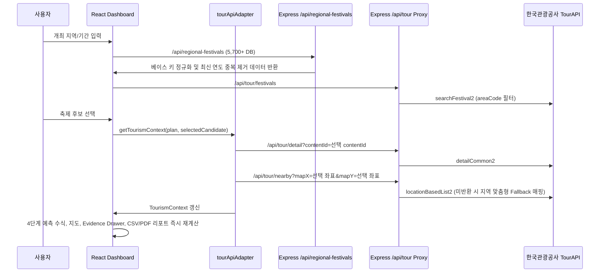

# 선택 축제 기준 데이터 갱신 흐름

## 목적

Fest-Twin은 TourAPI 후보 축제 또는 전국 축제 DB 축제를 선택했을 때 단순히 입력 폼의 축제명만 바꾸지 않고, 선택한 실제 축제 후보를 대시보드 전체의 공공데이터 및 수치 산출 기준으로 즉시 반영한다. 이 문서는 선택 축제 데이터 흐름과 정규화/중복 제거 파이프라인 및 갱신 프로세스를 기술한다.

## 사용자 흐름

1. 사용자가 개최 지역과 기간을 입력한다.
2. `TourAPI 후보 보기` 또는 `전체 축제 검색` 모달을 연다.
3. 목록에서 원하는 축제를 선택한다.
4. 선택 후보의 축제명, 주소, 기간, 좌표, `contentId`가 현재 기획안과 분석 기준으로 반영된다.
5. TourAPI 관광 컨텍스트, 지도, KPI 근거, 리포트 및 내보내기 데이터가 선택 후보 기준으로 100% 즉시 갱신된다.

## 데이터 흐름

## 선택 후보 기준값

| 값 | 용도 |
| :--- | :--- |
| `contentId` | TourAPI 상세 조회와 근거 추적의 기본 키 |
| `title` | 기획안 축제명, 검색 관심도 키워드, 리포트 제목 기준 |
| `address` | 행사장 주소와 지도 보조 정보 기준 |
| `startDate`, `endDate` | 분석 기간과 후보 기준 표시 |
| `mapX`, `mapY` | Naver 지도 위치와 TourAPI 주변 관광지 조회 기준 좌표 |

## 중복 제거 및 지역 맞춤 Fallback 파이프라인

1. 베이스 키 정규화 (Base Key Normalization)
   - 연도(2022~2026년) 및 회차(제XX회) 수치 표현을 제거하여 축제 고유 명칭 베이스 키를 추출
   - 동일 베이스 키에 대해 가장 최신 연도의 단일 레코드만 유지하여 중복 카드 표출 방지

2. 지역 맞춤형 주변 관광지 보강 데이터 생성기 (Regional Fallback Spots)
   - TourAPI 주변 관광지 실시간 조회 미반환 시 고정 서울 샘플 대신 축제의 위치 및 지역 정보(논산, 보령, 부산, 진주, 대전, 세종, 전주, 화천, 안동, 제주, 수원, 인천, 광주, 대구, 울산 등 16개 지역)와 일치하는 지역 대표 관광지 자동 생성

3. 개최 지역 필터링 엄격화 (Strict Region Matching)
   - 기획안 개최 지역 선택 시 DB 검색 및 TourAPI 후보 목록에서 타 지역 축제 혼입 우회 방지

## 갱신 범위 매트릭스

| 영역 | 후보 선택 후 갱신 기준 | 보존되는 선택 후보 값 | Fallback |
| :--- | :--- | :--- | :--- |
| TourAPI 관광 컨텍스트 | `contentId`, 축제명, 주소, 기간, 좌표가 refresh key에 포함된다. | `contentId`, `title`, `address`, `startDate`, `endDate`, `mapX`, `mapY` | 상세 조회 실패 시 후보 메타데이터와 지역 맞춤 샘플 주변 관광지로 보완한다. |
| 검색 관심도 | 축제명, 기간, 키워드, `contentId`가 바뀌면 Naver DataLab 요청을 다시 만든다. | 선택 축제명이 첫 번째 keyword group 이름과 첫 번째 keyword로 들어간다. | 프록시 실패 시 같은 축제명 기준 keyword group을 가진 샘플 관심도를 사용한다. |
| 교통 근거 | 축제명, 주소, 기간, 선택 시간, 좌표, `contentId`가 바뀌면 KTDB/View-T 조회 조건을 다시 만든다. | 행사장 주소와 선택 시간이 링크 매핑과 `time` 쿼리에 반영된다. | 링크 매핑 또는 조회 실패 시 후보 계획 기준 fallback 교통 근거를 표시한다. |
| 관광소비 | 지역, 축제명, 기간, `contentId`가 바뀌면 지역 관광 수요 강도 조회를 다시 만든다. | 지역과 시작월이 `areaCd`, `baseYm` 쿼리에 반영된다. | 조회 실패 시 같은 지역 기준 샘플 소비 단가를 표시한다. |
| 지도 | 선택 후보 좌표가 있으면 지도 중심과 마커 기준으로 사용한다. | `mapX`, `mapY`, `title`, `address` | 좌표가 없으면 입력 주소 중심 또는 기본 행사장 표시로 대체한다. |
| 보고서 | 현재 plan과 `selectedFestivalBasis`를 함께 받아 출력한다. | 선택 축제명, `contentId`, 기간, 주소가 데이터 출처 섹션에 남는다. | 선택 후보가 없으면 신규 기획안 기준 보고서로 표시한다. |
| KPI 근거 | `createMetricEvidenceSet`에 선택 후보 기준과 보조 데이터 컨텍스트를 함께 전달한다. | `tourapi-selected-festival-basis` source detail과 KPI별 원본 근거가 분리된다. | 후보 기준이 없으면 TourAPI/전국축제DB/샘플/사용자 입력 근거만 표시한다. |

## 관련 구현 파일

- `src/App.tsx`
- `src/services/tourApiAdapter.ts`
- `src/services/festivalSelection.ts`
- `src/services/metricEvidence.ts`
- `server/db/regionalFestivalDatabase.js`
- `src/components/DataBasisPanel.tsx`
- `src/components/ReportView.tsx`

## 관련 테스트

- `tests/festivalSwitch.test.ts`
- `src/App.selectedBasis.test.tsx`
- `src/services/dataAdapters.test.ts`
- `src/services/festivalSelection.test.ts`
- `src/services/tourApiAdapter.regionalDb.test.ts`
- `server/regionalFestivalDatabase.test.js`
- `src/services/metricEvidence.test.ts`
- `src/components/DataBasisPanel.test.tsx`
- `src/components/ReportView.selectedBasis.test.tsx`
