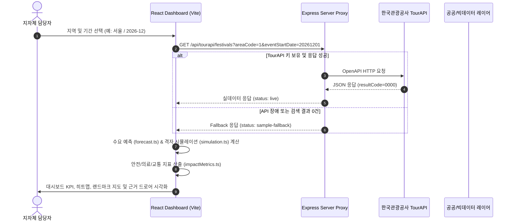

# Fest-Twin 시스템 종합 분석 보고서

본 보고서는 지자체 축제 사전 진단 B2G SaaS 플랫폼인 **Fest-Twin(페스트트윈)**의 전체 소스코드 분석 결과, 시스템 아키텍처, 데이터 흐름, 모듈별 구조 및 파일 단위 상세 기능을 정리한 종합 문서입니다.

---

## 1. 프로젝트 개요 (Executive Summary)

### 1.1 프로젝트 목적 및 주요 기능
**Fest-Twin**은 지자체 축제 담당자가 예산을 집행하기 전, 공공데이터와 시뮬레이션을 활용하여 **흥행 수요예측, 최고 밀집 위험도, 안전관리 요원/의료 인력 수용성, 상권 경제 파급효과, 예산 효율성**을 종합 진단하는 B2G 사전 진단 플랫폼입니다.

- **TourAPI 기반 지역 축제 탐색**: 한국관광공사 TourAPI 4.0을 연동하여 지자체별 연간/기간별 축제 후보 및 주변 관광 자원을 자동 조회합니다.
- **수요 예측 엔진**: 문체부 지역축제 실적 데이터베이스, 관광데이터랩 유동인구, 기상청 기후 예보 및 소셜 관심도를 종합 결합하여 시간대별 방문객 수요를 추정합니다.
- **군중 안전 및 혼잡 시뮬레이션**: 시간대별 예상 방문객과 행사장 시설 배치를 96개 격자 시뮬레이션에 반영하여 피크 시간대 병목 구역과 최고 밀집도(명/m²)를 진단합니다.
- **안전/의료 인력 및 물류 수용성 진단**: 행안부/소방청 안전관리 지침에 따른 안전요원 및 의료진 추천 배치 인원, 도로 링크별 접근 교통 위험도, 주차 차오름 비율을 산출합니다.
- **산출 근거 투명성 (Metric Evidence Drawer)**: 모든 KPI 수치에 대해 사용된 공공데이터 출처, 산출 공식, 가정을 투명하게 공개하고 오염/민감 데이터를 비식별 정화 처리합니다.
- **사전 검토 보고서 및 시나리오 관리**: 브라우저 로컬 저장소 기반 시나리오 저장/복원과 브라우저 인쇄(PDF Export)용 정부 제출용 서식 보고서를 제공합니다.

---

### 1.2 주요 기술 스택

| 영역 | 사용 기술 / 라이브러리 | 용도 및 설명 |
| :--- | :--- | :--- |
| **Frontend** | React 18, TypeScript, Vite | 사용자 대시보드 UI, 컴포넌트 기반 상태 관리 및 빌드 환경 |
| **Styling** | Vanilla CSS Design System | HSL 디자인 토큰, 시각적 계계화, 반응형 CSS 그리드 및 모바일 최적화 |
| **Testing** | Vitest, React Testing Library | 프론트엔드 비즈니스 로직, 어댑터, UI 인터랙션 단위/통합 테스트 |
| **Backend** | Node.js, Express | 공공데이터 REST API Proxy, HTTP Caching, Static Asset Server |
| **External API** | 한국관광공사 TourAPI 4.0 | 지역 기반 축제 목록 및 상세 정보, 주변 관광 자원 조회 |
| **Data Layer** | 문체부 지역축제 DB, 관광데이터랩, KTDB, 기상청 단기예보, Naver Map API | 수요예측 근거 데이터, 카드 소비 지출, 도로 교통 위험도, 기후 예보 및 랜드마크 시각화 |
| **Deployment** | Docker, Tailscale Funnel, Express | 컨테이너화된 운영 배포 및 공개 검토 데모 도메인 연동 |

---

### 1.3 아키텍처 및 데이터 흐름 (System Architecture)

Fest-Twin은 브라우저 번들에 API 키를 노출하지 않기 위해 **Express API Proxy** 계층을 두고, 데이터 수신 실패 시에도 대시보드가 중단되지 않도록 **Graceful Degradation (Fallback)** 아키텍처를 채택하고 있습니다.



---

## 2. 디렉터리 및 모듈 구조

```text
Fest-Twin/
├── server/                    # Express 백엔드 서버 및 공공데이터 Proxy 레이어
│   ├── index.js               # 서버 엔트리포인트 및 정적 파일 서빙
│   ├── tourProxy.js           # 한국관광공사 TourAPI 4.0 프록시 로직
│   ├── spendingProxy.js       # 관광데이터랩 카드 소비 데이터 프록시
│   └── trafficProxy.js        # 국가교통DB(KTDB) 교통량 데이터 프록시
├── src/
│   ├── main.tsx               # React 앱 렌더링 엔트리포인트
│   ├── App.tsx                # 통합 대시보드 상태 관리 및 레이아웃 메인
│   ├── styles.css             # Vanilla CSS 글로벌 디자인 시스템 및 레이아웃
│   ├── domain/                # 핵심 도메인 인터페이스 및 타입 정의
│   │   └── types.ts           # FestivalPlan, ForecastResult, MetricEvidence 등 전체 타입
│   ├── data/                  # 공공데이터 정규화 샘플 및 Fallback 데이터셋
│   │   ├── sampleTourApi.ts   # TourAPI 기본 샘플 데이터
│   │   ├── sampleDemandBackdata.ts # 문체부 지역축제 실적 백데이터
│   │   ├── sampleSpending.ts  # 관광데이터랩 소비지출 백데이터
│   │   ├── sampleTraffic.ts   # KTDB 도로 통행속도 및 정체 백데이터
│   │   ├── sampleTrends.ts    # 소셜 관심도 샘플 데이터
│   │   └── sampleFestivalPlan.ts # 기본 입력 축제 기획안 (강남 미디어 윈터페스타)
│   ├── services/              # 수치 계산 엔진, 어댑터 및 비즈니스 로직
│   │   ├── tourApiAdapter.ts  # TourAPI 응답 파싱 및 지역 후보 탐색 어댑터
│   │   ├── demandBackdataAdapter.ts # 유사 축제 수요예측 베이스라인 매칭 어댑터
│   │   ├── spendingAdapter.ts # 소비 추정 및 상권 유출 연계 어댑터
│   │   ├── trafficAdapter.ts  # 도로 교통 위험도 및 링크 정체 어댑터
│   │   ├── weatherAdapter.ts  # 기상청 예보 기반 수요 가감 어댑터
│   │   ├── forecast.ts        # 시간대별 수요 예측 알고리즘 계산 엔진
│   │   ├── simulation.ts      # 96개 격자 군중 밀집 시뮬레이션 엔진
│   │   ├── impactMetrics.ts   # 안전/의료/교통/경제 지표 종합 산출기
│   │   ├── metricEvidence.ts  # 지표별 출처, 공식, 산출 근거 생성기
│   │   ├── report.ts          # 진단 리포트 및 기획 보완 추천안 작성 엔진
│   │   └── scenarioStorage.ts # 브라우저 LocalStorage 기반 시나리오 저장소
│   ├── components/            # 사용자 인터페이스 React 컴포넌트
│   │   ├── GovernmentHeader.tsx # 상단 헤더 및 B2G 검토 상태
│   │   ├── PlanForm.tsx       # 축제 기획안 입력 및 조건 변경 폼
│   │   ├── FestivalCandidatePanel.tsx # TourAPI 지역 축제 후보 선택 드로어
│   │   ├── SummaryKpiCards.tsx # 흥행/밀집/예산/상권 핵심 4대 KPI 카드
│   │   ├── SafetyLogisticsPanel.tsx # 안전/의료/교통/주차 수용성 4대 카드
│   │   ├── ForecastChart.tsx  # 시간대별 수요 예측 바 차트
│   │   ├── Heatmap.tsx        # 96격자 군중 밀집 위험 시뮬레이션 히트맵
│   │   ├── VenueMapPanel.tsx  # 행사장 위치 및 주변 랜드마크 시각화 패널
│   │   ├── RoiEconomicImpact.tsx # 예산 대비 경제적 파급효과 산출 패널
│   │   ├── DataBasisPanel.tsx # 공공데이터 연동 상태 및 출처 요약 패널
│   │   ├── MetricEvidenceDrawer.tsx # 투명한 산출 근거 상세 보기 드로어
│   │   ├── ReportView.tsx     # B2G 사전 진단 종합 보고서 화면
│   │   └── ScenarioLibrary.tsx # 시나리오 저장 및 불러오기 패널
│   └── government/            # 정부 가이드라인 준수 검증 모듈
│       ├── guidelines.ts      # 전자정부, CSAP, 개인정보보호 지침 정의
│       └── readiness.ts       # 준수 현황 체크 및 자가 진단 평가기
├── scripts/
│   └── build-submission-zip.js # 공모전 제출용 압축 패키지 생성 빌더
└── docs/                      # 제출 서류, 가이드 및 기술 명세서 디렉터리
```

---

## 3. 소스코드별 상세 분석 (각 파일 단위)

### 3.1 백엔드 및 서버 계층 (`server/`)

#### 1. `server/index.js`
- **작성 이유/목적**: Express 프록시 서버의 엔트리포인트로, API 라우팅을 등록하고 빌드된 프론트엔드 정적 파일(`dist/`)을 서빙합니다.
- **주요 기능**:
  - `/api/tourapi/*`, `/api/spending/*`, `/api/traffic/*` REST API 라우터 등록
  - `/api/health` 헬스체크 응답 (`status: ok`)
  - SPA 지원을 위한 Catch-all 정적 서빙 라우트 구현
- **연관 모듈**: `server/tourProxy.js`, `server/spendingProxy.js`, `server/trafficProxy.js`

#### 2. `server/tourProxy.js`
- **작성 이유/목적**: 한국관광공사 TourAPI 4.0 통신을 중계하여 브라우저에 인증키가 노출되는 것을 방지합니다.
- **주요 기능**:
  - `fetchTourApiFromService`: 서버 환경변수 `TOUR_API_KEY`를 주입하여 TourAPI OpenAPI 호출
  - `GET /api/tourapi/festivals`: 지역코드 및 행사시작일 기준 축제 목록 조회
  - `GET /api/tourapi/detail`: 콘텐츠 ID 기준 상세 설명 조회
  - 인증키 미설치 시 장애 없이 `status: sample-fallback` 응답 전송
- **연관 모듈**: `server/index.js`, `src/services/tourApiAdapter.ts`

#### 3. `server/spendingProxy.js`
- **작성 이유/목적**: 관광데이터랩 BC/신한카드 소비지출 데이터 요청을 중계합니다.
- **주요 기능**:
  - `GET /api/spending/summary`: 지역별/업종별 관광 객단가 및 상권 지출 데이터 반환
  - API 미연동 시 파일 정규화 샘플 데이터셋으로 자동 Fallback
- **연관 모듈**: `server/index.js`, `src/services/spendingAdapter.ts`

#### 4. `server/trafficProxy.js`
- **작성 이유/목적**: 국가교통DB(KTDB) 및 ITS 도로 링크별 통행 속도 데이터 요청을 중계합니다.
- **주요 기능**:
  - `GET /api/traffic/links`: 행사장 주변 주요 도로 링크 통행속도 및 혼잡 지수 반환
  - LINKID 단위 정체 위험도 산출 데이터 제공
- **연관 모듈**: `server/index.js`, `src/services/trafficAdapter.ts`

---

### 3.2 도메인 및 데이터 계층 (`src/domain/`, `src/data/`)

#### 5. `src/domain/types.ts`
- **작성 이유/목적**: Fest-Twin 전체 시스템에서 사용되는 도메인 모델, DTO, 상태 인터페이스를 일관되게 정의합니다.
- **주요 기능**:
  - `FestivalPlan`: 지자체 축제 기획안 (지역, 기간, 예산, 수용인원, 위치 좌표 등)
  - `ForecastResult`, `SimulationResult`: 수요예측 및 96격자 밀집 시뮬레이션 결과 타입
  - `MetricEvidence`, `MetricEvidenceId`: 지표별 산출 근거, 데이터 출처, 가치 기여도 타입
  - `TourismContext`, `TrafficContext`, `SpendingContext`: 각 공공데이터 연동 상태 타입
- **연관 모듈**: 시스템 전반의 모든 컴포넌트, 어댑터, 비즈니스 로직 파일에서 참조

#### 6. `src/data/sampleTourApi.ts`
- **작성 이유/목적**: TourAPI 연동이 불가능한 로컬/오프라인 환경에서도 대시보드가 정상 동작하도록 시범 축제 샘플 데이터를 제공합니다.
- **주요 기능**: `sampleFestivals`, `sampleAreaCodes` 및 `sampleTourismContext` 제공
- **연관 모듈**: `src/services/tourApiAdapter.ts`

#### 7. `src/data/sampleDemandBackdata.ts`
- **작성 이유/목적**: 문화체육관광부 지역축제 정보 실적 기반의 정규화된 방문객 및 예산 레코드를 제공합니다.
- **주요 기능**: 유사 축제 선정 시 실적 데이터베이스 기준선으로 활용되는 `sampleRegionalFestivalRecords` 제공
- **연관 모듈**: `src/services/demandBackdataAdapter.ts`

#### 8. `src/data/sampleSpending.ts` & `src/data/sampleTraffic.ts`
- **작성 이유/목적**: 관광데이터랩 소비지출 및 KTDB 도로 링크 정체 데이터를 샘플링하여 오프라인 Fallback을 보장합니다.
- **연관 모듈**: `src/services/spendingAdapter.ts`, `src/services/trafficAdapter.ts`

---

### 3.3 서비스 및 어댑터 계층 (`src/services/`)

#### 9. `src/services/tourApiAdapter.ts`
- **작성 이유/목적**: 백엔드 프록시 응답을 파싱하여 대시보드가 사용할 수 있는 관광 도메인 모델로 변환합니다.
- **주요 기능**: `fetchTourismContext`, `selectFestivalCandidate`, `fetchAreaCodes`
- **연관 모듈**: `src/App.tsx`, `src/components/FestivalCandidatePanel.tsx`

#### 10. `src/services/demandBackdataAdapter.ts`
- **작성 이유/목적**: 입력된 기획안과 유사한 지역/유형의 과거 축제 방문객 실적 데이터를 매칭합니다.
- **주요 기능**: `createDemandBackdataContext` - 예산 및 수용 규모가 유사한 백데이터 추출
- **연관 모듈**: `src/services/forecast.ts`, `src/services/metricEvidence.ts`

#### 11. `src/services/forecast.ts`
- **작성 이유/목적**: 축제 시간대별 예상 방문객 수와 피크 시간대를 산출하는 핵심 수요 예측 엔진입니다.
- **주요 기능**: `createForecast` - 유사 축제 베이스라인, 주변 관광 매력도, 기후 가감율, 소셜 관심도를 복합 적용하여 시간대별 수요 배열 생성
- **연관 모듈**: `src/services/simulation.ts`, `src/services/impactMetrics.ts`

#### 12. `src/services/simulation.ts`
- **작성 이유/목적**: 96개 격자 시뮬레이션을 통해 군중 밀집 병목 구역과 최고 밀집도(명/m²)를 진단합니다.
- **주요 기능**: `createSimulation` - 피크 시간대 인원을 행사장 격자에 배치하고 위험 수준(안전/주의/경고/위험) 분류
- **연관 모듈**: `src/components/Heatmap.tsx`, `src/services/impactMetrics.ts`

#### 13. `src/services/impactMetrics.ts`
- **작성 이유/목적**: 안전요원, 의료진, 교통 위험도, 주차 차오름 비율 등 물류/안전 수용성 지표를 종합 산출합니다.
- **주요 기능**: `createSafetyLogisticsMetrics`, `createSummaryKpis`, `createEconomicRoi`
- **연관 모듈**: `src/components/SafetyLogisticsPanel.tsx`, `src/components/SummaryKpiCards.tsx`

#### 14. `src/services/metricEvidence.ts`
- **작성 이유/목적**: 모든 대시보드 수치에 대해 투명한 공공데이터 출처, 공식, 가정을 포함하는 근거 세트를 생성하고 오염 수치를 정화합니다.
- **주요 기능**: `buildMetricEvidenceSet`, `redactContaminatedSourceDetails`
- **연관 모듈**: `src/components/MetricEvidenceDrawer.tsx`, `src/App.tsx`

#### 15. `src/services/report.ts`
- **작성 이유/목적**: 사전 진단 결과를 바탕으로 예산 낭비, 안전 위험, 상권 연계 부족을 진단하고 기획 보완 추천안을 생성합니다.
- **주요 기능**: `createReport` - 정부 검토용 텍스트 리포트 및 인쇄용 구조화 데이터 생성
- **연관 모듈**: `src/components/ReportView.tsx`

#### 16. `src/services/scenarioStorage.ts`
- **작성 이유/목적**: 담당자가 작성한 여러 축제 기획안 시나리오를 브라우저 `localStorage`에 안전하게 보관 및 복원합니다.
- **주요 기능**: `loadScenarios`, `saveScenario`, `deleteScenario`
- **연관 모듈**: `src/components/ScenarioLibrary.tsx`

---

### 3.4 사용자 인터페이스 계층 (`src/components/`)

#### 17. `src/App.tsx`
- **작성 이유/목적**: 전체 대시보드의 최상위 메인 컴포넌트로, 입력 상태, API 연동 상태, 시뮬레이션 결과 및 드로어 상태를 통합 관리합니다.
- **주요 기능**: 기획안 변경 이벤트 핸들링, 근거 드로어 열기/닫기, 시나리오 선택 및 전체 레이아웃 구성
- **연관 모듈**: `src/components/*` 전체 컴포넌트

#### 18. `src/components/SafetyLogisticsPanel.tsx`
- **작성 이유/목적**: 안전관리 요원 추천 배치, 의료/구급 인력 추천 배치, 접근 교통 위험도, 주차 수용 차오름 비율 등 안전/물류 4대 지표를 규격화된 카드 그리드로 시각화합니다.
- **주요 기능**: 4열/2열 반응형 그리드, 단어 단위 개행 정돈, 표준화된 `근거 보기` 버튼 연동
- **연관 모듈**: `src/services/impactMetrics.ts`, `src/components/EvidenceButton.tsx`

#### 19. `src/components/SummaryKpiCards.tsx`
- **작성 이유/목적**: 흥행 예측 지수, 최고 밀집 위험도, 예산 효율성 점수, 지역 상권 유출 연계도 핵심 4대 KPI 카드를 강조 표시합니다.
- **연관 모듈**: `src/services/impactMetrics.ts`

#### 20. `src/components/MetricEvidenceDrawer.tsx`
- **작성 이유/목적**: 담당자가 특정 수치의 `근거 보기` 버튼을 누르면 우측에서 슬라이딩하여 해당 지표의 데이터 출처, 산출 공식, 가정을 투명하게 공개하는 서브 창입니다.
- **연관 모듈**: `src/services/metricEvidence.ts`

#### 21. `src/components/VenueMapPanel.tsx`
- **작성 이유/목적**: Naver Map API v3를 활용하여 행사장 위치 및 주변 관공서, 파출소, 응급실, 주차장 랜드마크를 지도 위에 시각화합니다. (API 키 미설치 시 Fallback 렌더링)
- **연관 모듈**: Naver Map JavaScript SDK v3

#### 22. `src/components/ReportView.tsx`
- **작성 이유/목적**: 예산 집행 전 지자체 내부 보고 및 브라우저 인쇄(PDF Export)용 공식 리포트 화면을 제공합니다.
- **연관 모듈**: `src/services/report.ts`, `src/components/PrintReportButton.tsx`

---

### 3.5 정부 가이드라인 및 빌드 스크립트 (`src/government/`, `scripts/`)

#### 23. `src/government/readiness.ts` & `guidelines.ts`
- **작성 이유/목적**: 전자정부 서비스 가이드라인, CSAP, 개인정보 최소 수집 정책 준수 여부를 자가 평가합니다.
- **주요 기능**: `assessReadiness` - B2G 검토 준비도 점수 및 미충족 세부 지침 목록 산출
- **연관 모듈**: `src/components/GovernmentReadinessPanel.tsx`

#### 24. `scripts/build-submission-zip.js`
- **작성 이유/목적**: 공모전 제출 및 평가 심사용 최종 아티팩트(`artifacts/fest-twin-submission-package.zip`)를 자동 압축 생성하는 Node.js 빌드 스크립트입니다.
- **주요 기능**: `docs/`, `src/`, `server/`, `package.json`, 제출 증빙 이미지를 압축 패키징
- **연관 모듈**: `package.json` (`npm run build:zip`)

---

## 4. 특이사항 및 개선 제안 (Optional)

### 4.1 시큐어 코딩 및 API Key 보안
- **강점**: TourAPI 인코딩/디코딩 키는 브라우저 번들 및 클라이언트 코드에 전혀 포함되지 않으며, 오직 Node.js 서버 런타임 환경변수(`TOUR_API_KEY`)로만 관리됩니다.
- **보안 유지**: Naver Map Client ID 역시 공개용 키이나 `.env` 빌드 아규먼트로 관리하여 원본 코드베이스의 민감 정보 노출을 방지했습니다.

### 4.2 데이터 장애 격리 (Graceful Degradation)
- **강점**: 공공데이터 OpenAPI 장애, 네트워크 타임아웃, 또는 키 미설치 시에도 대시보드가 멈추지 않고 샘플 공공데이터 Fallback으로 전환되며, 사용자에게 연동 상태를 명확히 고지합니다.

### 4.3 향후 확장 및 리팩토링 제안
1. **Redis 캐싱 계층 도입**: TourAPI 및 국가교통DB(KTDB) API의 동일한 지역/링크 중복 요청에 대해 Redis 캐시를 적용하면 외부 API 쿼터 절감 및 응답 속도 향상이 가능합니다.
2. **시나리오 서버 영속화 및 RDBMS 연동**: 현재 시나리오 저장이 브라우저 `localStorage` 기반이므로, 지자체 부서 간 공동 편집을 위해 PostgreSQL 기반 데이터베이스 영속화 저장이 요구됩니다.
3. **OAuth2 / GPKI 인증 도입**: 지자체 담당자 전용 B2G SaaS 전환 시 공무원 GPKI 또는 OAuth2 기반 인증/인가 체계 도입을 추천합니다.
