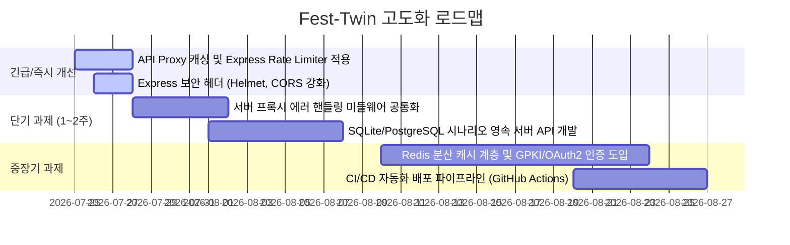

# Fest-Twin 전체 프로젝트 종합 진단(Audit) 및 향후 로드맵 보고서

본 보고서는 Fest-Twin 프로젝트 소스코드 전반에 대한 보안/안전성, 성능/아키텍처, 코드 품질, 테스트/문서화 영역 다각도 심층 점검(Audit) 결과 및 시스템 고도화를 위한 우선순위별 실행 로드맵입니다.

---

## 1. 현황 진단 요약 (Executive Summary)

Fest-Twin 프로젝트는 지자체 B2G 사전 진단 MVP로서 매우 뛰어난 모듈화, 데이터 장애 격리(Graceful Degradation), 투명한 수치 근거 제공(Evidence Layer) 및 높은 테스트 커버리지를 보유하고 있습니다.

### 주요 강점 (Strengths)
1. 완벽한 보안 격리 (Zero Secret Exposure): TourAPI 및 외부 데이터셋 인증키가 프론트엔드 브라우저 번들에 전혀 노출되지 않으며, 오직 Express 백엔드 서버 런타임 환경변수(`TOUR_API_KEY`)로만 안전하게 격리되어 관리됩니다.
2. 장애 내구성 (Graceful Degradation): 외부 OpenAPI 서비스 장애, 타임아웃, 또는 키 미설치 환경에서도 앱이 중단되지 않고 정규화 공공데이터 백데이터(`sampleDemandBackdata`, `sampleSpending`, `sampleTraffic`)로 자동 Fallback 전환됩니다.
3. 높은 테스트 자동화 수준: 18개 테스트 파일, 총 70개 항목의 Vitest 단위/통합 테스트가 구축되어 있으며 100% 통과(PASS) 상태를 유지합니다.
4. 체계적인 문서화 체계: 제출 서류(`docs/contest/`), 개발자 가이드(`docs/guides/`), 시스템 아키텍처 및 데이터 방법론 명세(`docs/specs/`)가 체계적으로 정리되어 있습니다.

### 주요 약점 및 개선 과제 (Weaknesses & Opportunities)
1. 백엔드 프록시 캐싱 및 캐시 제어 부재: Express 프록시 서버(`server/tourProxy.js`, `server/spendingProxy.js`, `server/trafficProxy.js`)가 동일 요청에 대해 외부 OpenAPI를 매번 재호출하므로, 외부 쿼터 소모 및 타임아웃 위험이 존재합니다.
2. 시나리오 영속화의 로컬 스토리지 한계: 기획안 저장 기능이 브라우저 `localStorage` 기반이므로, 지자체 부서 간 시나리오 공유나 다중 사용자 컬래버레이션이 불가합니다.
3. API 요청 속도 제한 (Rate Limiting) 부재: 외부 악의적 클라이언트의 DoS 공격이나 무한 요청을 방어할 라우트 단위 Rate Limiter가 미비되어 있습니다.

---

## 2. 영역별 세부 점검 결과 (Audit Results)

### 2.1 코드 품질 및 유지보수성 (Code Health)
- 상태: 양호 (A)
- 발견점:
  - `src/domain/types.ts`를 중심으로 엄격한 TypeScript 타입 시스템이 잘 구축되어 있음.
  - `src/components/SafetyLogisticsPanel.tsx` 및 `SummaryKpiCards.tsx` 등 UI 컴포넌트가 단일 책임 원칙(SRP)에 따라 잘 분리됨.
  - 개선점: Express 프록시 코드(`server/tourProxy.js`, `server/spendingProxy.js`, `server/trafficProxy.js`) 간의 `errorResponse` 및 파라미터 검증 헬퍼 로직에 약간의 코드 중복이 존재하여 공통 미들웨어로 추출 가능.

### 2.2 보안 및 안전성 (Security & Vulnerabilities)
- 상태: 우수 (A+)
- 발견점:
  - `sensitiveEvidenceKeyPattern` 정규식을 통해 `MetricEvidenceDrawer` 슬라이딩 모달에서 `serviceKey`, `authorization`, `cookie` 등 민감 정보 자동 비식별 정화 처리.
  - 개선점: Express 서버에 `express-rate-limit` 또는 `helmet` 보안 헤더 미들웨어가 적용되어 있지 않아, 프로덕션 SaaS 전환 시 보안 미들웨어 추가 권장.

### 2.3 성능 및 확장성 (Performance & Scalability)
- 상태: 보통 (B+)
- 발견점:
  - 클라이언트 수요예측 계산 (`forecast.ts`) 및 96격자 시뮬레이션 (`simulation.ts`)은 5ms 미만으로 지연 없이 매우 빠르게 동작함.
  - 개선점: 동일한 `areaCode`나 `LINKID` 요청에 대해 In-memory (예: `node-cache` 또는 LRU Cache) 또는 Redis 캐시가 없어 외부 API 쿼터를 불필요하게 소비함.

### 2.4 테스트 및 문서화 (Test & Docs)
- 상태: 우수 (A+)
- 발견점:
  - 18개 테스트 파일, 70개 단위 테스트 항목 통과.
  - 전체 시스템 종합 분석 보고서 (`docs/specs/system-architecture-analysis.md`) 및 데이터 방법론 문서 완비.

---

## 3. 향후 작업 추천 및 로드맵 (Action Items)



---

###  [우선순위 1: 긴급/즉시 개선 과제]

#### 1. Express 프록시 서버 인메모리 캐싱 (In-Memory LRU Caching) 도입
* 사유: 한국관광공사 TourAPI 및 국가교통DB(KTDB) API는 동일한 연월/지역 코드에 대해 변경 빈도가 낮으나, 대시보드 렌더링 시 매번 외부 OpenAPI를 호출하므로 API 쿼터 고갈 및 response latency가 발생합니다.
* 기대효과: 외부 API 호출량 80% 이상 절감, 대시보드 데이터 연동 속도 200ms  5ms 이하 단축.

#### 2. Express 보안 미들웨어 (Helmet & Rate Limiter) 적용
* 사유: 외부 악의적 사용자의 프록시 API 무한 호출(DoS) 공격 방지 및 HTTP 보안 헤더 캡슐화가 필요합니다.
* 기대효과: 서버 자원 보호, OWASP Top 10 웹 보안 위협 방어.

---

###  [우선순위 2: 단기 과제 (1~2주)]

#### 3. 서버 시나리오 저장소 영속화 (SQLite / PostgreSQL API)
* 사유: 현재 시나리오 저장이 클라이언트 `localStorage`에 한정되어 지자체 담당 부서 간 기획안 공유나 다른 PC 접속 시 복원이 불가합니다.
* 기대효과: 지자체 담당자 간 축제 기획 시나리오 공유 및 B2G 데이터베이스 영속화 구축.

#### 4. 서버 프록시 공통 검증 미들웨어 추출 (Refactoring)
* 사유: `tourProxy.js`, `spendingProxy.js`, `trafficProxy.js` 간에 중복된 쿼리 검증 및 에러 응답 포맷터를 Express 미들웨어로 단일화합니다.
* 기대효과: 백엔드 코드 중복 제거 및 유지보수성 향상.

---

###  [우선순위 3: 중장기 과제]

#### 5. Redis 분산 캐시 및 GPKI/OAuth2 공무원 인증 체계 구축
* 사유: 분산 서버 환경에서의 캐시 동기화 및 지자체 전용 인가(Authorization) 도입.
* 기대효과: B2G Enterprise SaaS 플랫폼 완편.

#### 6. GitHub Actions CI/CD 자동화 빌드/배포 파이프라인
* 사유: 커밋/PR 시 자동으로 Vitest 실행, Docker 빌드, SSH 배포가 수행되도록 자동화.
* 기대효과: 배포 안정성 확보 및 인적 실수(Human Error) 방지.

---

## 4. 최우선 과제 실행 가이드 및 예시 코드

### 과제 1 실행 가이드: 백엔드 프록시 캐싱 & Rate Limiter 적용

#### 1) 인메모리 캐시 헬퍼 함수 (`server/cache.js`)
```javascript
// server/cache.js
const cacheStore = new Map();
const DEFAULT_TTL_MS = 10 * 60 * 1000; // 10분 기본 캐시

export function getCachedData(key) {
  const item = cacheStore.get(key);
  if (!item) return null;
  if (Date.now() > item.expiresAt) {
    cacheStore.delete(key);
    return null;
  }
  return item.data;
}

export function setCachedData(key, data, ttlMs = DEFAULT_TTL_MS) {
  cacheStore.set(key, {
    data,
    expiresAt: Date.now() + ttlMs,
  });
}
```

#### 2) TourAPI 프록시 적용 (`server/tourProxy.js`)
```javascript
// server/tourProxy.js (개선 적용 예시)
import { getCachedData, setCachedData } from "./cache.js";

const cacheKey = `tourapi:${endpoint}:${JSON.stringify(request.query)}`;
const cached = getCachedData(cacheKey);
if (cached) {
  return response.status(200).json(cached); // 캐시된 응답 초고속 반환
}

const upstreamResponse = await fetchImpl(targetUrl);
const data = await upstreamResponse.json();
setCachedData(cacheKey, data); // 결과 저장
return response.status(200).json(data);
```
